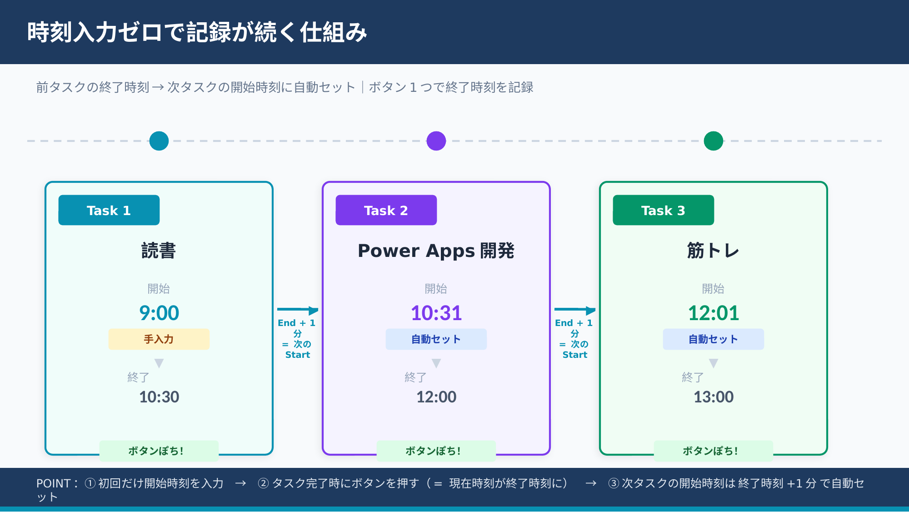

# powerapps-worklog

**記録魔という狂気に、あなたも一歩足を踏み入れませんか。**

何かを変えようと思ったら、まずは現状を数字で徹底的に把握する必要があります。
このアプリは「自分の時間の使い方を、まず知りたい」という動機から生まれた行動ログシステムです。

2025年3月に作成し、約1年間・3,500件以上の記録を積み重ねてきた実績があります。
だいたい30分に1回のペースで記録をつけています。

---

## 作った背景・1年間の振り返り

詳しくはこちらのブログ記事をご覧ください：
https://flow-with-tech.com/lifelogging-system-with-power-apps-one-year-review/

---

## 構成

| コンポーネント | 説明 |
|---|---|
| **キャンバスアプリ** | スマホ・PCから素早く記録するための入力画面。時刻の入力不要で記録ができます。 |
| **モデル駆動型アプリ** | 蓄積データの一覧表示・グラフ可視化。プロジェクトやカテゴリの追加もここから。 |
| **Dataverse** | 全行動ログを保存する中核データベース |

### 時刻入力不要な仕組みの説明

これがこのアプリの中で、**最も画期的で狂気的**なところです。

### キャンバスアプリ画面説明

こんな感じです。基本的に時刻は入力不要です。

  

### Dataverse テーブル構成

- `Transaction`（行動記録）
- `ProjectMaster`（プロジェクト管理）
- `CategoryMaster`（カテゴリ管理）

### 記録項目

| 項目 | 内容 |
|---|---|
| Date | 日付 |
| StartTime / EndTime | 開始・終了時刻 |
| Duration | 所要時間（分） |
| WorkLog_Project | プロジェクト名（例: Power Apps, 散歩） |
| WorkLog_Category | カテゴリ（例: 市民開発, 運動, 趣味, 生活） |
| ActionName | 具体的な行動名 |
| Notes | メモ |

---

## インストール方法

### 前提条件

- Microsoft Power Apps Premiumライセンス（有償版のやつです）
- Dataverse が利用できる環境（開発者プログラムでも大丈夫だと思います）

> 間違えていたらすみません。その際はご指導ください。

### 手順

1. `workLogDistribution_1_0_0_3.zip` をダウンロードする
2. [Power Apps メーカーポータル](https://make.powerapps.com) を開く
3. 左メニュー「ソリューション」→「インポート」をクリック
4. ダウンロードした `.zip` ファイルを選択してインポート
5. インポート完了後、キャンバスアプリとモデル駆動型アプリが利用可能になります

> **注意**: インポート後、"The formula is empty."という警告が出ますが、データがないことが原因なので、無視してください。 データ追加すれば大丈夫です。

---

## ライセンス

MIT License
